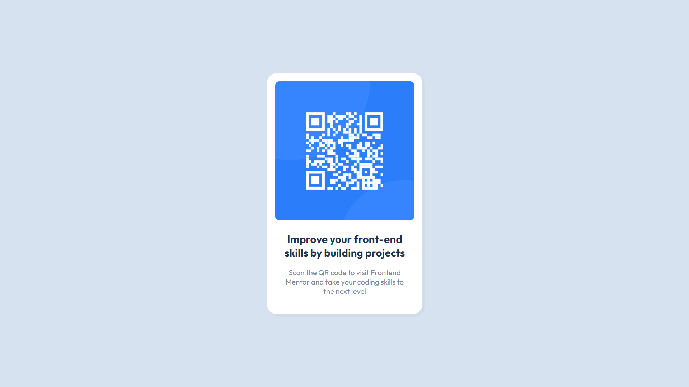

# Frontend Mentor - QR code component solution

This is a solution to the [QR code component challenge on Frontend Mentor](https://www.frontendmentor.io/challenges/qr-code-component-iux_sIO_H).

## Table of contents

- [Overview](#overview)
  - [Screenshot](#screenshot)
  - [Links](#links)
- [My process](#my-process)
  - [Built with](#built-with)
  - [What I learned](#what-i-learned)
- [Author](#author)

## Overview

### Screenshot

### Links

- Solution URL: [Add solution URL here](https://github.com/Deepanshu-Kaushik/qr-code-component-main/)
- Live Site URL: [Add live site URL here](https://deepanshu-kaushik.github.io/qr-code-component-main/)

## My process

### Built with

- Semantic HTML5 markup
- CSS custom properties
- Flexbox
- CSS Grid

### What I learned

In this project, I honed my skills in web development by focusing on the fundamentals of HTML and CSS, with a particular emphasis on mastering Flexbox. Through the implementation of Flexbox, I gained a deeper understanding of creating responsive and visually appealing designs. 

The project served as a practical exercise, allowing me to translate a given image into a QR card using the acquired skills. This hands-on experience not only enhanced my proficiency in Flexbox but also provided me with a solid foundation in turning design concepts into tangible web elements. 

The QR card project, documented here, showcases my growth and newfound comfort in designing web components based on visual references, underscoring the importance of a strong foundation in HTML and CSS for effective web development.

## Author

- Linkedin - [Deepanshu Kaushik](https://www.linkedin.com/in/hello-deepanshu/)
- Frontend Mentor - [@Deepanshu-Kaushik](https://www.frontendmentor.io/profile/Deepanshu-Kaushik)
- LeetCode - [@DeepanshuKaushik](https://leetcode.com/DeepanshuKaushik/)
